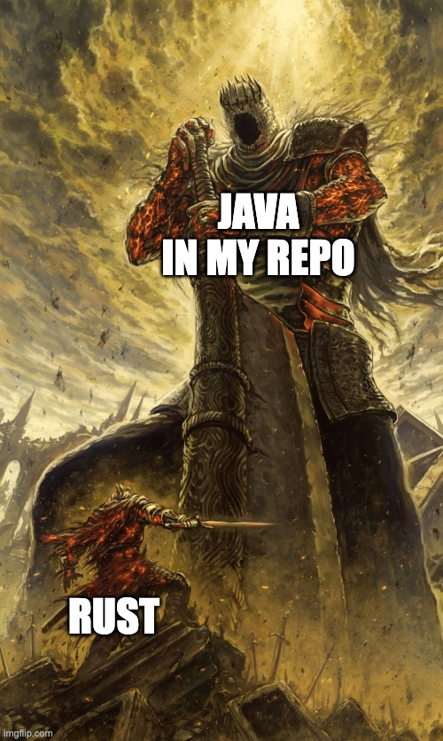

#   [My profile](https://leetcode.com/dirdr/)
## My submissions to various LeetCode problems in Java and Rust

I first started leetcoding in java but the focus is now in rust 🦀. \
\
This repository aims to help me find previously implemented algorithms, as well as tracking my progression,
i'm currently following the [neetcode](https://neetcode.io/roadmap) roadmap

